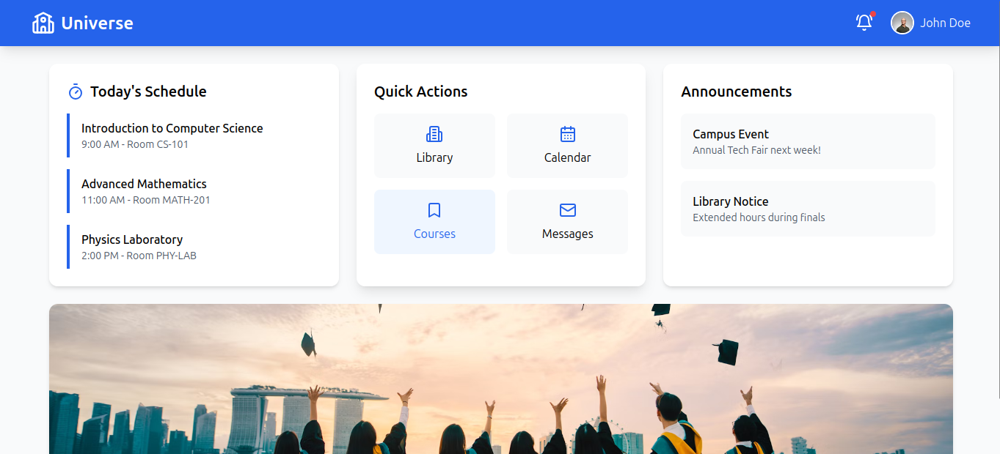

Site link - https://cerulean-entremet-82be95.netlify.app/


# Universe - University Dashboard

A modern, responsive university dashboard application built with React, TypeScript, and Tailwind CSS. This application provides students with a centralized platform to manage their academic life, including course schedules, library resources, announcements, and quick access to essential university services.

## 🌟 Features

### Dashboard Overview
- **Today's Schedule**: View daily class schedule with times and room locations
- **Quick Actions**: Fast access to Library, Calendar, Courses, and Messages
- **Announcements**: Stay updated with campus news and important notices
- **Notifications**: Real-time alerts for grades, assignments, and campus events
- **Profile Management**: User profile with settings and sign-out functionality

### Library System
- **Book Search**: Search through the university's book catalog
- **Book Status Tracking**: View availability, checked-out, and reserved books
- **Due Date Management**: Track return dates for borrowed books
- **Recently Returned**: Quick access to recently returned books
- **Library Statistics**: Overview of total books and availability

### User Experience
- **Responsive Design**: Optimized for desktop, tablet, and mobile devices
- **Modern UI**: Clean, professional interface with smooth animations
- **Intuitive Navigation**: Easy-to-use interface with clear visual hierarchy
- **Interactive Elements**: Hover effects and micro-interactions for better UX

## 🚀 Live Demo

The application is deployed and accessible at: [https://cerulean-entremet-82be95.netlify.app](https://cerulean-entremet-82be95.netlify.app)

## 🛠️ Technology Stack

- **Frontend Framework**: React 18.3.1
- **Language**: TypeScript
- **Styling**: Tailwind CSS
- **Icons**: Lucide React
- **Routing**: React Router DOM
- **Build Tool**: Vite
- **Deployment**: Netlify

## 📦 Installation

1. **Clone the repository**
   ```bash
   git clone <repository-url>
   cd universe-dashboard
   ```

2. **Install dependencies**
   ```bash
   npm install
   ```

3. **Start the development server**
   ```bash
   npm run dev
   ```

4. **Open your browser**
   Navigate to `http://localhost:5173` to view the application

## 🏗️ Project Structure

```
src/
├── components/          # Reusable UI components
├── pages/              # Page components
│   └── Library.tsx     # Library management page
├── App.tsx             # Main application component
├── main.tsx           # Application entry point
└── index.css          # Global styles and Tailwind imports
```

## 📱 Pages & Features

### Dashboard (Home)
- **Today's Schedule**: Displays current day's classes with time and location
- **Quick Actions Grid**: Four-button grid for quick navigation
- **Announcements Panel**: Campus news and important updates
- **Header Navigation**: Profile menu and notifications dropdown

### Library Page
- **Search Functionality**: Search books by title, author, or topic
- **Book Catalog**: Complete list of available books with status indicators
- **Status Management**: Visual indicators for Available, Checked Out, and Reserved books
- **Due Date Tracking**: Clear display of return dates for borrowed items
- **Statistics Dashboard**: Quick overview of library metrics

## 🎨 Design Features

### Visual Design
- **Color Scheme**: Professional blue and gray palette
- **Typography**: Clean, readable fonts with proper hierarchy
- **Spacing**: Consistent 8px grid system
- **Cards**: Rounded corners with subtle shadows
- **Status Indicators**: Color-coded badges for different states

### Interactive Elements
- **Hover Effects**: Smooth transitions on buttons and cards
- **Dropdown Menus**: Animated profile and notification dropdowns
- **Responsive Grid**: Adaptive layout for different screen sizes
- **Loading States**: Smooth transitions and feedback

## 🔧 Available Scripts

- `npm run dev` - Start development server
- `npm run build` - Build for production
- `npm run preview` - Preview production build
- `npm run lint` - Run ESLint for code quality

## 📋 Development Guidelines

### Code Style
- **TypeScript**: Strict type checking enabled
- **ESLint**: Configured with React and TypeScript rules
- **Component Structure**: Functional components with hooks
- **File Organization**: Clear separation of concerns

### Best Practices
- **Responsive Design**: Mobile-first approach
- **Accessibility**: Semantic HTML and proper ARIA labels
- **Performance**: Optimized images and lazy loading
- **Code Quality**: Consistent formatting and naming conventions

## 🚀 Deployment

The application is configured for easy deployment to Netlify:

1. **Build the project**
   ```bash
   npm run build
   ```

2. **Deploy to Netlify**
   - Connect your repository to Netlify
   - Set build command: `npm run build`
   - Set publish directory: `dist`

## 🔮 Future Enhancements

### Planned Features
- **Calendar Integration**: Full calendar view with event management
- **Grade Tracking**: GPA calculation and grade history
- **Course Materials**: Document sharing and assignment submission
- **Messaging System**: Internal communication platform
- **Mobile App**: React Native version for iOS and Android

### Technical Improvements
- **Authentication**: User login and session management
- **Database Integration**: Backend API for data persistence
- **Real-time Updates**: WebSocket integration for live notifications
- **Offline Support**: Progressive Web App capabilities

## 🤝 Contributing

1. Fork the repository
2. Create a feature branch (`git checkout -b feature/amazing-feature`)
3. Commit your changes (`git commit -m 'Add amazing feature'`)
4. Push to the branch (`git push origin feature/amazing-feature`)
5. Open a Pull Request


## 🙏 Acknowledgments

- University administration for requirements and feedback
- Student body for user testing and suggestions
- Open source community for the excellent tools and libraries

---

**Universe Dashboard** - Empowering students with a modern, intuitive platform for academic success.
